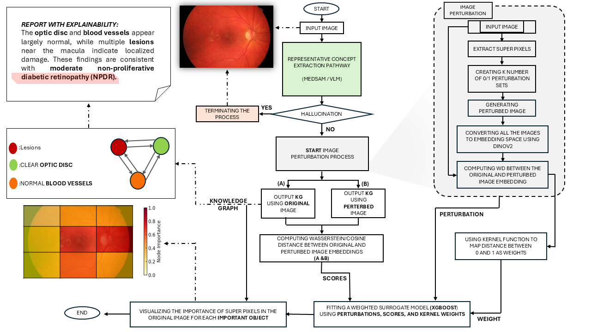

# ConceptSMILE

A perturbation-based approach to auditing concept-level explanation reliability: mask image regions, measure concept-response shifts, compute locality weights and fit a local surrogate.

**AMBER: transparent research release with incomplete historical reproducibility.** This package contains reusable reconstructed utilities, sanitised historical evidence and explicitly labelled manuscript transcriptions. It does not reproduce the full paper or validate its disputed comparative results. Start with [FINAL_REPOSITORY_STATUS.md](FINAL_REPOSITORY_STATUS.md).
## ConceptSMILE framework

<p align="center">
  
</p>

<p align="center">
  <em>Overview of the ConceptSMILE framework. The pipeline extracts concept-level outputs,
  applies controlled superpixel perturbations, computes locality weights, and fits a local
  surrogate model for reliability auditing.</em>
</p>
## Evidence you can inspect

- MedSAM and Qwen2.5-VL notebooks each demonstrate one image from an ODIR mirror. Source cells and plain-text outputs are preserved; embedded visuals/rich displays are removed with an [audit trail](docs/audits/preservation_manifest.csv).
- The manuscript reports 40 images across HRF, APTOS, ODIR-5K and IDRiD. The [historical manifest is unavailable](data/manifests/README.md).
- [Tables 2–7](results/manuscript_transcribed/README.md) are MANUSCRIPT-TRANSCRIBED, not computed reproductions.
- Historical MedSAM reference metrics mean **model-mask-reference agreement**. VLM attribution is a **self-referential, row-misaligned diagnostic**, not independent ground-truth accuracy. VLM Pearson uses global removed fraction, and legacy consistency measures R² dispersion. These limitations remain unresolved scientifically.
- Stability, full VLM robustness, four-dataset row-level outputs and exact Figure9–11 provenance are incomplete. Table arithmetic/duplication concerns are documented in the [final scientific audit](docs/audits/final-scientific-audit.md).

## Install and check

Python 3.10 or later, from this repository root:

```bash
python -m pip install -e .[dev]
python -m pytest
python -m conceptsmile
python scripts/synthetic_smoke_test.py
python scripts/validate_config.py configs/paper.yaml
python scripts/audit_manuscript_tables.py
```

These are software checks and transcription audits, not retinal experiments. See [validation](docs/audits/validation.md) for actual outcomes. Candidate model dependencies have not been validated end-to-end.

## Organisation and use

| Path | Purpose |
| --- | --- |
| `src/conceptsmile/` | RECONSTRUCTED perturbation, locality, surrogate and metric utilities |
| `notebooks/legacy/` | Sanitised historical notebook derivatives |
| `configs/paper.yaml` | Reported paper specification, unknown execution values null |
| `configs/legacy/` | Notebook-specific settings and archived prior defaults |
| `results/manuscript_transcribed/` | Reported numeric tables, never labelled reproduction |
| `results/preserved/` | Original notebook output index |
| `docs/audits/` | Arithmetic, cross-table, provenance and validation records |

Obtain datasets independently using [provider instructions](docs/datasets.md). The repository does not redistribute the source datasets or model weights. Manuscript figures are included under `figures/` for documentation; however, the provenance and redistribution status of underlying retinal images and any third-party graphical elements are not fully established. See [figure provenance](figures/README.md) for details. There is no full-data reproduction command. See [reproducibility](docs/reproducibility.md) for requirements for a future rerun and [traceability](MANUSCRIPT_CODE_TRACEABILITY.md) for equations and results.

[Provenance categories](docs/scientific_provenance.md): ORIGINAL, PRESERVED, RECONSTRUCTED, RE-RUN, MANUSCRIPT-TRANSCRIBED, UNVERIFIED and NOT AVAILABLE. Their meanings distinguish a copied statement from evidence that an experiment was executed.

## Responsible AI, citation and rights

This is not a diagnostic model or clinical validation. It does not certify safety, establish causality or demonstrate clinician usefulness. Small sample size, extractor dependence, broad concepts, artificial perturbations and VLM sensitivity limit conclusions. See [Responsible AI](docs/responsible_ai.md).

[CITATION.cff](CITATION.cff) matches the six manuscript authors; no publication date, DOI or acceptance details are invented. [LICENSE](LICENSE) retains the existing all-rights-reserved statement. **Author licence decision required** for broader reuse; this is not an open-source release.

[Repository](https://github.com/MohadesehMollpour/ConceptSMILE). This ZIP is a local deliverable based on submission-ready commit 83a10462036a7b8de7ce356cf617a98d67357131. No changes were pushed, merged or published in preparing it. Package clearance does not clear images or secrets in an existing repository's history.
